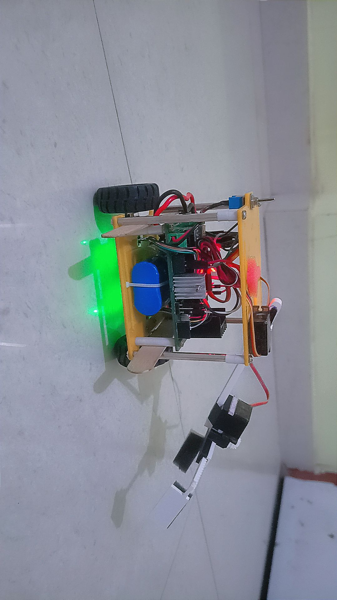

	

# BalanceBot Workspace

This repository collects the BalanceBot self-balancing robot project across hardware firmware, simulation controllers, control-theory experiments, and supporting documentation.

The project is intentionally broad. It includes polished final files, older task variants, and reference material gathered during experimentation. The root layout has been cleaned so that the main working areas are easy to find and the generated clutter stays out of the way.

## What This Repo Contains

The workspace is organized around four practical areas:

- Hardware firmware for the balancing robot and task-specific variants.
- CoppeliaSim / V-REP style simulation controllers and scene assets.
- MATLAB and Python scripts for inverted-pendulum and control analysis.
- Reports, logs, and reference material that document how the project evolved.

## Repository Layout

### `firmware/`
Arduino sketches for the embedded robot.

- `sbraman/balancebot_main.ino` is the main balance-and-actuation sketch.
- `simplepid/simplepid.ino` contains a simpler PID-focused variant set.
- `task5/bb_1545_task5.ino` is the task-specific integrated firmware.

The remaining `.ino` files in those folders are preserved as legacy tuning variants and experiments.

### `simulation/`
CoppeliaSim scenes, task solutions, and Python controllers.

- `task0a/task0a.py` is the Task 0A controller entry point.
- `task1a/task1a.py` is the main Task 1A solution.
- `task1b/task1b_solution.py` is the canonical Task 1B solution.
- `task1c/task1c_solution.py` is the canonical Task 1C solution.
- `task2a/task2a_solution.py` is the canonical Task 2A solution.
- `task2b/task2b_solution.py` is the canonical Task 2B solution.

Each task folder may still contain older Windows variants, nested scene folders, or local API copies that were kept for historical comparison.

### `control/`
Control-theory scripts and supporting numerical utilities.

- `matlab/cartpend.m` models the cart-pendulum system.
- `matlab/matlabeyrc.m` supports the broader MATLAB control workflow.
- `matlab/sim.py` is a Python helper for simulation-based analysis.

### `assets/`
Reusable simulator assets and model files.

- `model/base.ttm` is the main CoppeliaSim base model asset.

### `analysis/logs/`
Consolidated output logs and tuning results.

- Task output files are stored here instead of next to the source scripts.
- Filenames are source-based so repeated runs remain distinguishable.

### `docs/`
High-level and technical documentation.

- `BALANCEBOT_DETAILED_REPORT.md` is the deep technical report.
- `TECHNICAL_README.md` covers methods, implementation notes, and project context.

### `archive/`
Local-only reference material that should not be treated as the main source tree.

- External repositories were moved here during cleanup.
- Historical notes and completed material are also grouped here.

## Canonical Entry Points

When looking for the main files in each area, start here:

- `firmware/sbraman/balancebot_main.ino`
- `firmware/simplepid/simplepid.ino`
- `firmware/task5/bb_1545_task5.ino`
- `simulation/task0a/task0a.py`
- `simulation/task1a/task1a.py`
- `simulation/task1b/task1b_solution.py`
- `simulation/task1c/task1c_solution.py`
- `simulation/task2a/task2a_solution.py`
- `simulation/task2b/task2b_solution.py`
- `control/matlab/cartpend.m`
- `control/matlab/matlabeyrc.m`
- `control/matlab/sim.py`

## Quick Start

1. Install Python 3.10 or newer.
2. Run `pip install -r requirements.txt` from the repository root.
3. Install CoppeliaSim if you want to open or run the `.ttt` and `.ttm` assets.
4. Install Arduino IDE or another compatible toolchain if you want to upload the `.ino` sketches.
5. Use MATLAB or Octave for the control-theory scripts under `control/`.

## Common Workflows

### Hardware development

Start in `firmware/sbraman/` if you want the main robot firmware, or in `firmware/simplepid/` if you want a simpler tuning baseline.

Typical hardware loop:

1. Tune a controller variant.
2. Test it in simulation where possible.
3. Flash the selected `.ino` to the robot.
4. Record results in `analysis/logs/`.

### Simulation development

Start in `simulation/` if you are working on the task solutions or controller logic.

Typical simulation flow:

1. Open the scene file for the task you want to test.
2. Run the associated Python controller.
3. Compare outputs with the saved logs.
4. Promote the best-performing variant to the canonical solution file.

### Control-theory work

Use `control/matlab/` for model derivation, linearization, and response analysis.

This area is useful for:

- Inverted pendulum modeling.
- Linearized system analysis.
- LQR and PID comparisons.
- Cross-checking simulation behavior against theory.

## Coding and File-Conventions

- Keep new task output files in `analysis/logs/`.
- Prefer descriptive, lowercase filenames for new source files.
- Avoid adding new zip files, compiled binaries, pyarmor runtime folders, or Python caches to the repository.
- Use `archive/` for local-only reference material and completed experiments that are not part of the main source tree.

## Dependencies

The root `requirements.txt` lists the Python packages used across the simulation and analysis scripts.

The current list includes:

- `numpy`
- `scipy`
- `sympy`
- `pandas`
- `plotly`
- `matplotlib`
- `opencv-python`
- `pyzmq`
- `coppeliasim-zmqremoteapi-client`
- `jupyter`
- `ipykernel`

## Notes On Historical Content

This repo intentionally keeps some older task variants and legacy folders for reference. They are useful for understanding the project history, but they are not the preferred starting point for new work.

If you are trying to modify the project, use the canonical entry points listed above instead of the older variants.

## Documentation

For deeper background, see:

- `docs/BALANCEBOT_DETAILED_REPORT.md`
- `docs/TECHNICAL_README.md`

If you plan to continue cleaning or publishing the repo, the next useful step is to trim the remaining legacy task branches and decide which historical variants should stay in `archive/`.
